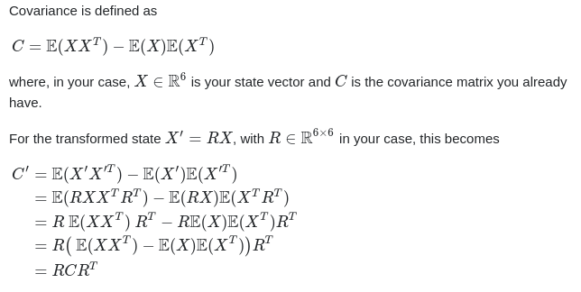

## Math

TODO - create documentation for this API

## Rotations

TODO - create documentation for this API

## Frames

This library implements a set of templates to convert between ENU frame and NED frames, both for angles expressed in the inertial frame and in the body frame of a vehicle.

### **Conventions on quaternion rotations between frames**

In ROS a quaternion expresses a rotation of the body frame of the vehicle (which is ENU, i.e. ENU_base_link) with respect to (w.r.t) the inertial frame of reference in ENU (i.e. ENU_inertial_frame).

Note that in ENU_base_link, the X-axis comes out of the front of the vehicle and a Z-axis that goes "out of the vehicle in upwards direction".

On the other hand, in marine and aerial vehicles it is typical to consider a body frame which is expressed in NED_base_link, where the X-axis also comes out of the front of the vehicle but the Z-axis goes "out of the vehicle in downwards direction", according to the following figure (adapted from PX4 website). Therefore, according to the literature, a quaternion should express a rotation of the body frame of the vehicle (which is NED, i.e. NED_base_link) with respect to (w.r.t) the inertial frame of reference in NED (i.e. NED_inertial_frame).


From the Figure it is trivial to conclude that rotating ENU_base_link <-> NED_base_link is different then rotating ENU_inertial_frame <-> NED_inertial_frame. This comes from the fact that in the body frame, both ENU and NED conventions arbitrate that the X axis comes forwards of the vehicle (this axis does not change), while in the inertial frame you can see from the figure above that it does change.

Now that we have explained both the rotations in the body and inertial frames, let's see how to perform them:

1. **Inertial Frame**

    1.1) To convert a rotation expressed in ENU to a rotation expressed in NED, we must apply the following rotation (using Z-Y-X convention):
        
        - Rotate 90º about Z-axis
        - Rotate 0º about Y-axis
        - Rotate 180º about X-axis

    1.2) To convert a rotation expressed in NED to a rotation expressed in ENU, we must apply the following rotation (using Z-Y-X convention):

        - Rotate -90º about Z-axis
        - Rotate 180º about Y-axis
        - Rotate 0º about X-axis

2. **Body Frame** (a.k.a ROS base_link)

    2.1) To convert a rotation expressed in the ENU body frame (ROS base_link) to a rotation expressed in NED body frame (the typical body frame adopted for aerial and marine crafts), we must apply the following rotation (using Z-Y-X convention):

        - Rotate 0º about Z-axis
        - Rotate 0º about Y-axis
        - Rotate 180º about X-axis

    2.2) To convert a rotation expressed in the NED body frame (the typical body frame adopted for aerial and marine crafts) to a rotation expressed in the ENU body frame (ROS base_link), we must apply the following rotation (using Z-Y-X convention):

        - Rotate 0º about Z-axis
        - Rotate 0º about Y-axis
        - Rotate -180º about X-axis

Given this knowledge, we can now convert a ROS quaternion/rotation expressed in ENU_inertial_frame w.r.t. ENU_base_link to a "regular" quaternion expressed in NED_inertial_frame w.r.t. NED_base_link.

1. **ROS** -> **"regular"**

    ```
    - State: rotation in ENU w.r.t. ENU_base_link
    - Action: Apply body frame rotation (operation 2.1)
    - State: rotation in ENU w.r.t. NED_base_link
    - Action: Apply inertial frame rotation (operation 1.1)
    - State: rotation in NED w.r.t. NED_base_link
    ```

2. **"regular"** -> **ROS**

    ```
    - State: rotation in NED w.r.t. NED_base_link
    - Action: Apply body frame rotation (operation 2.2)
    - State: rotation in NED w.r.t. ENU_base_link
    - Action: Apply inertial frame rotation (operation 1.2)
    - State: rotation in ENU w.r.t. ENU_base_link
    ```
### **Transform vectors and covariances between frames**

For vectors w.r.t body or inertial frames expressed in ENU (Forward, Left, Up) , the transformation to express them in NED (Forward, Right, Down) depends on their respective frame of reference. 
    
To transform vectors w.r.t the **body-frame** the conversion is quite simple  and only requires us to:
    ```
    - apply an 180º rotation around X (Forward) axis 
    ```

To transform vectors w.r.t the **inertial-frame** the conversion is different and is made in the following way:
    ```
    - Switch XY axis
    - Invert the Z axis
    ```

Regarding coordinate frame conversion for covariance matrices, the principle is similar, however, the computations are slightly different as shown on the following image.


    
    
## Spherical Coordinates

TODO - create documentation for this API
